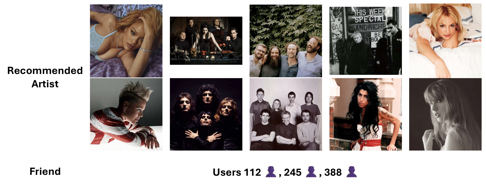
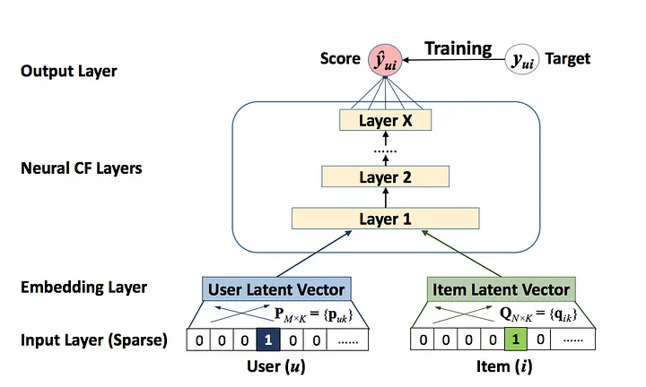

# Recommendation: Music Artist

This project focuses on recommending music artists to users based on their listening habits and social connections using a neural collaborative filtering (NCF) approach.

## Table of Contents
- [Introduction](#introduction)
- [Data](#data)
- [Methods](#methods)
- [Results](#results)
  - [Example Recommendations](#example-recommendations)
- [Directory Structure](#directory-structure)
- [Installation](#installation)
  - [Conda Environment Setup](#conda-environment-setup)
  - [Docker Setup (Optional)](#docker-setup-optional)
- [Usage](#usage)
  - [Run Main Script](#run-main-script)
  - [Run Each Source Module (Optional)](#run-each-source-module-optional)
    - [Data Preparation](#data-preparation)
    - [Training](#training)
    - [Inference](#inference)

## Introduction

The application uses NCF to recommend music artists based on user listening patterns and social relationships. The dataset is derived from HetRec 2011's Last.fm subset, which contains listening habits, user friendships, and tagging information.

Below is an example of the top-10 recommended music artists for User 959, alongside their friend list from the database:



## Data

The dataset is the Last.fm subset of HetRec 2011. It contains user listening histories, artist information, user friendships, and tagging data. This dataset has:
- 1892 users
- 17,632 artists
- 92,834 user-listened artist interactions
- 12,717 bi-directional user friendships

The dataset also includes tag assignments by users to artists. Detailed statistics and file formats can be found in the dataset's accompanying documentation.

The users' names and other personal information in Last.fm are not provided in the dataset. The data contained in `hetrec2011-lastfm-2k.zip` is made available for non-commercial use. For more information, visit [the HetRec 2011 page on GroupLens](https://grouplens.org/datasets/hetrec-2011/).

> Cantador, I., Brusilovsky, P., & Kuflik, T. (2011). Second Workshop on Information Heterogeneity and Fusion in Recommender Systems (HetRec 2011). ACM RecSys. [Paper link](https://dl.acm.org/doi/10.1145/2043932.2044016)

## Methods

NCF is employed for this project. NCF combines embedding layers and multi-layer perceptrons (MLPs) to learn complex user-item interaction patterns in recommendation tasks. The model includes:
- User and artist embeddings: Captures latent features for users and artists.
- MLP layers: Captures high-order interactions between users and artists.
- Binary classification: Predicts whether a user is likely to interact with an artist.



*Figure from [Neural Collaborative Filtering by Abhishek Sharma](https://towardsdatascience.com/neural-collaborative-filtering-96cef1009401).*

> He, X., Liao, L., Zhang, H., Nie, L., Hu, X., & Chua, T.-S. (2017). Neural Collaborative Filtering. WWW.  
  [Paper link](https://arxiv.org/abs/1708.05031)

## Results

### Example Recommendations

Refer to the `results/recommendations.txt` for the recommendations for ten randomly selected users, alongside their friend lists.

## Directory Structure

```
recommendation-music-artist/
├── configs/                    # Pre-trained model configurations
├── data/                       # Dataset
│   ├── preprocessed/           # Preprocessed data
│   └── raw/                    # Raw downloaded data
├── Dockerfile                  # Docker setup
├── environment.yml             # Conda environment setup
├── example.png                 # Example of User 959
├── LICENSE                     # Project license
├── main.py                     # Main pipeline script
├── ncf.png                     # Illustration of NCF
├── README.md                   # Project README
├── requirements.txt            # Python dependencies
├── results/                    # Outputs from inference
│   └── recommendations.txt     # Example recommendations with friend lists
└── src/                        # Source code
    ├── data.py                 # Data preparation script
    ├── infer.py                # Inference script
    └── train.py                # Training script
```

## Installation

### Conda Environment Setup

1. Clone the repository:
   ```bash
   git clone https://github.com/your-ai-solution/recommendation-music-artist.git
   cd recommendation-music-artist
   ```

2. Create a Conda environment:
   ```bash
   conda env create -f environment.yml
   conda activate recommendation-music-artist
   ```

3. Install dependencies:
   ```bash
   pip install -r requirements.txt
   ```

### Docker Setup (Optional)

1. Build the Docker image:
   ```bash
   docker build -t recommendation-music-artist .
   ```

2. Run the Docker container:
   ```bash
   docker run --gpus all -v $(pwd)/data:/app/data -v $(pwd)/results:/app/results recommendation-music-artist
   ```

##  Usage

### Run Main Script

1. Place [the dataset ZIP](https://files.grouplens.org/datasets/hetrec2011/hetrec2011-lastfm-2k.zip) in `data/raw/`. 

2. Run the main script that automates the entire pipeline:
   ```bash
   python main.py
   ```

### Run Each Source Module (Optional)

1. Data preparation: Preprocess the raw dataset.
   ```bash
   python -m src.data
   ```

2. Training: Train a transformer model.
   ```bash
   python -m src.train
   ```

3. Inference: Run inference on the test dataset.
   ```bash
   python -m src.infer
   ```